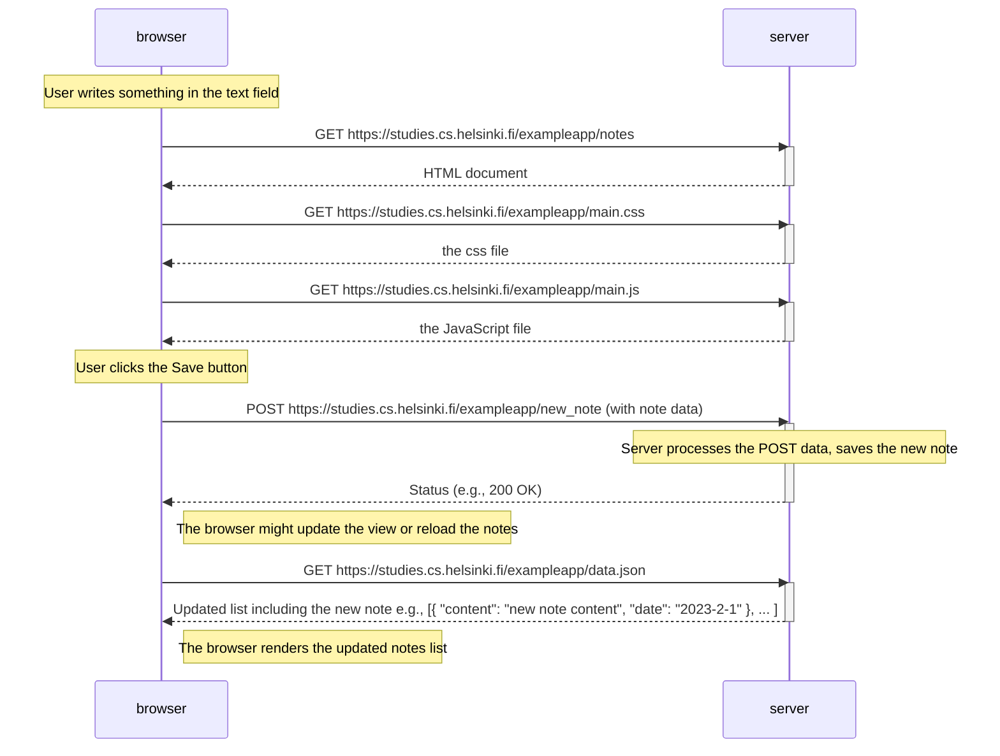

```mermaid
sequenceDiagram
    participant browser
    participant server

    Note over browser: User writes something in the text field

    browser->>server: GET https://studies.cs.helsinki.fi/exampleapp/notes
    activate server
    server-->>browser: HTML document
    deactivate server

    browser->>server: GET https://studies.cs.helsinki.fi/exampleapp/main.css
    activate server
    server-->>browser: the css file
    deactivate server

    browser->>server: GET https://studies.cs.helsinki.fi/exampleapp/main.js
    activate server
    server-->>browser: the JavaScript file
    deactivate server

    Note over browser: User clicks the Save button

    browser->>server: POST https://studies.cs.helsinki.fi/exampleapp/new_note (with note data)
    activate server
    Note over server: Server processes the POST data, saves the new note
    server-->>browser: Status (e.g., 200 OK)
    deactivate server

    Note right of browser: The browser might update the view or reload the notes

    browser->>server: GET https://studies.cs.helsinki.fi/exampleapp/data.json
    activate server
    server-->>browser: Updated list including the new note e.g., [{ "content": "new note content", "date": "2023-2-1" }, ... ]
    deactivate server

    Note right of browser: The browser renders the updated notes list
```